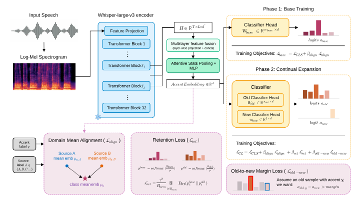

# AccentCL: Robust Accent Classification with Incremental Expansion (SLT 2026)

<a href="#"></a>
<a href="https://anonymized0826.github.io/AccentCL/"></a>
<br>

This is the official repository for the paper

"AccentCL: Robust Accent Classification with Incremental Expansion"

by [Mu-Ruei Tseng](https://github.com/Morris88826), [Waris Quamer](https://github.com/warisqr007), [Ghady Nasrallah](https://github.com/Ghadynasrallah), [Ricardo Gutierrez-Osuna](https://scholar.google.com/citations?user=UnuQfEwAAAAJ&hl=en)

Department of Computer Science & Engineering, Texas A&M University

## News
**Sep. 2026:** AccentCL is accepted to SLT 2026.

## Introduction

<p align="center">
  
</p>

Accent classifiers are typically trained with a fixed label inventory and cannot accommodate new accent categories as new data becomes available, while accented speech corpora often exhibit substantial class imbalance and cross-corpus domain shift. AccentCL is a class-incremental learning framework for English accent classification that is robust to both. It extracts multi-layer representations from a frozen Whisper-Large-v3 encoder, trains with an imbalance-aware cross-entropy loss and a domain-mean-alignment loss, and expands its label space via replay-based continual learning — using the frozen base model for knowledge retention and an old-to-new margin loss to reduce overprediction on newly added classes.

For more information, please check out our [Demo Page](https://anonymized0826.github.io/AccentCL/).

## Highlights

- **Multi-layer Whisper features**: fuses hidden states from four Whisper-Large-v3 encoder layers (16, 20, 24, 28) via attentive statistics pooling, rather than relying on the final layer alone.
- **Imbalance- and domain-robust training**: logit-adjusted cross-entropy plus a domain-mean-alignment loss reduce bias toward majority accents and cross-corpus recording-condition shift.
- **Class-incremental expansion**: new accent classes can be added on top of a trained model using a small, domain-stratified replay memory, a frozen-teacher retention loss, and an old-to-new margin loss — with only ~10% of the original training data retained as replay.
- **State-of-the-art regional accent classification**: +11.3 balanced-accuracy and +8.8 macro-F1 points over Voxlect (Whisper-Large-v3) on the shared 5-class regional label space, with consistent gains on held-out (OOD) corpora.
- **83.3 F1 / 61.8 F1** on newly added Spanish- and Chinese-accented English respectively, while retaining ~77% balanced accuracy on the original five accent classes.

## Results

5-class regional accent classification (see the paper for full experimental setup):

| Method | Acc | Bal. Acc | Macro-F1 | OOD Acc | OOD Bal. Acc | OOD Macro-F1 |
|---|---|---|---|---|---|---|
| CommonAccent | 56.0 | 48.3 | 48.6 | 79.0 | 53.6 | 58.2 |
| Voxlect (Whisper-Large-v3) | 64.8 | 65.8 | 68.1 | 83.8 | 77.5 | 82.6 |
| **AccentCL** | **76.0** | **77.1** | **76.9** | **89.7** | **79.6** | **83.0** |

Class-incremental expansion (new-class F1 / old-class balanced accuracy):

| Step | New class | New F1 | Old Bal. Acc |
|---|---|---|---|
| 5 → 6 | + Spanish-accented English | 83.3 | 77.3 |
| 6 → 7 | + Chinese-accented English | 61.8 | 77.6 |

## Supported accent labels

The released checkpoints cover the following labels, added incrementally:

| Checkpoint | Labels |
|---|---|
| `accentcl_base.pt` | `north_american`, `british_isles`, `australasian`, `south_asian`, `southeast_asian` |
| `accentcl_spanish.pt` | base 5 + `spanish` |
| `accentcl_spanish_chinese.pt` | base 5 + `spanish` + `chinese` |

Use `accentcl_spanish_chinese.pt` unless you specifically need an earlier checkpoint in the incremental sequence.

## Installation

Requires Python 3.10+.

```bash
conda create -n accentcl python=3.12 -y
conda activate accentcl
pip install torch torchaudio transformers librosa numpy pandas matplotlib
```

Whisper-Large-v3 is downloaded automatically from Hugging Face on first use. A GPU is recommended — the encoder is large enough that CPU inference will be noticeably slow.

## Pretrained checkpoints

Checkpoints are not stored in this git repository (each is ~2.4GB). Download them from [Google Drive](https://drive.google.com/drive/folders/1y9pFXNIRpBpLCuALHX6sb6ZXiyA4oA0F?usp=sharing) and place them under `checkpoints/`:

```
checkpoints/
├── accentcl_base.pt
├── accentcl_spanish.pt
└── accentcl_spanish_chinese.pt
```

## Quick start

```python
import torch
import librosa
from src.accentcl.models.accentcl import WhisperCLAccentModel

device = torch.device("cuda") if torch.cuda.is_available() else "cpu"

model = WhisperCLAccentModel.from_checkpoint(
    "./checkpoints/accentcl_spanish_chinese.pt", device=device
)
model.eval()
print(model.label2id)

wav, _ = librosa.load("./samples/north_american/sample01.wav", sr=16000)
audio_tensor = torch.tensor(wav).unsqueeze(0).to(device)

pred_labels, logits, _ = model.predict(audio_tensor, return_feature=False)
print(f"Predicted accent: {pred_labels[0]}")
```

Input audio should be mono, resampled to 16kHz; utterances longer than 30 seconds are truncated. See [`inference.ipynb`](inference.ipynb) for a runnable single-file example, and [`demo.ipynb`](demo.ipynb) for a batch demo that reproduces confusion matrices over the bundled [`samples/`](samples) audio (out-of-domain clips from IDEA, not used in training).

## Repository structure

```
src/accentcl/
├── models/          # WhisperCLAccentModel and the underlying multi-layer Whisper encoder
├── data/             # dataset / augmentation / sampling utilities
├── losses/           # logit adjustment, retention, old-to-new margin, domain alignment losses
└── evaluation/        # evaluation metrics used to reproduce the paper's tables
src/demo/             # plotting helpers used by demo.ipynb
checkpoints/           # pretrained weights (not tracked in git, see above)
samples/               # out-of-domain example audio per accent, used by the notebooks
figures/               # figures referenced in the paper and this README
inference.ipynb        # minimal single-utterance inference example
demo.ipynb             # batch demo + confusion matrix over samples/
```

## Citation
TODO
