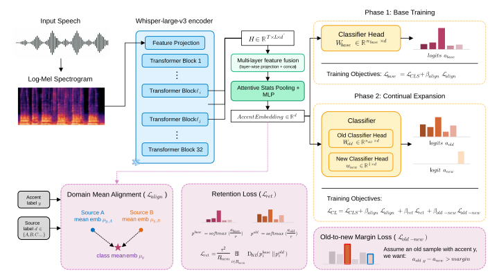

# AccentCL: Robust Accent Classification with Incremental Expansion (SLT 2026)

<a href="https://arxiv.org/abs/2610.07426">
  
</a>
<a href="https://huggingface.co/Morris88826/accentcl">
  
</a>
<a href="https://psi-tamu.github.io/AccentCL/">
  
</a>
<br>

This is the official repository for the paper

**"AccentCL: Robust Accent Classification with Incremental Expansion"**

by [Mu-Ruei Tseng](https://github.com/Morris88826), [Waris Quamer](https://github.com/warisqr007), [Ghady Nasrallah](https://github.com/Ghadynasrallah), [Ricardo Gutierrez-Osuna](https://scholar.google.com/citations?user=UnuQfEwAAAAJ&hl=en)

Department of Computer Science & Engineering, Texas A&M University

## News

**Sep. 2026:** AccentCL is accepted to IEEE SLT 2026.

## Introduction

<p align="center">
  
</p>

Accent classifiers are typically trained with a fixed label inventory and cannot accommodate new accent categories as new data becomes available, while accented speech corpora often exhibit substantial class imbalance and cross-corpus domain shift. AccentCL is a class-incremental learning framework for English accent classification that is robust to both. It extracts multi-layer representations from a frozen Whisper-Large-v3 encoder, trains with an imbalance-aware cross-entropy loss and a domain-mean-alignment loss, and expands its label space via replay-based continual learning — using the frozen base model for knowledge retention and an old-to-new margin loss to reduce overprediction on newly added classes.

For more information, please check out our [Demo Page](https://psi-tamu.github.io/AccentCL/).

## Highlights

- **Multi-layer Whisper features:** Fuses hidden states from four Whisper-Large-v3 encoder layers (16, 20, 24, 28) via attentive statistics pooling, rather than relying on the final layer alone.
- **Imbalance- and domain-robust training:** Logit-adjusted cross-entropy plus a domain-mean-alignment loss reduce bias toward majority accents and cross-corpus recording-condition shift.
- **Class-incremental expansion:** New accent classes can be added on top of a trained model using a small, domain-stratified replay memory, a frozen-teacher retention loss, and an old-to-new margin loss — with only ~10% of the original training data retained as replay.
- **State-of-the-art regional accent classification:** +11.3 balanced-accuracy and +8.8 macro-F1 points over Voxlect (Whisper-Large-v3) on the shared 5-class regional label space, with gains on held-out (OOD) corpora.
- **83.3 F1 / 61.8 F1** on newly added Spanish- and Chinese-accented English respectively, while retaining ~77% balanced accuracy on previously learned accent classes.

## Results

5-class regional accent classification (see the paper for full experimental setup):

| Method | Acc | Bal. Acc | Macro-F1 | OOD Acc | OOD Bal. Acc | OOD Macro-F1 |
|---|---|---|---|---|---|---|
| CommonAccent | 56.0 | 48.3 | 48.6 | 79.0 | 53.6 | 58.2 |
| Voxlect (Whisper-Large-v3) | 64.8 | 65.8 | 68.1 | 83.8 | 77.5 | 82.6 |
| **AccentCL** | **76.0** | **77.1** | **76.9** | **89.7** | **79.6** | **83.0** |

*All values are percentages (%). OOD results are evaluated on Speech Accent Archive and IDEA, which are not used as training sources.*

Class-incremental expansion (new-class F1 / old-class balanced accuracy):

| Step | New Class | New F1 | Old Bal. Acc |
|---|---|---|---|
| 5 → 6 | + Spanish-accented English | 83.3 | 77.3 |
| 6 → 7 | + Chinese-accented English | 61.8 | 77.6 |

*All values are percentages (%). Old Bal. Acc is calculated over classes learned before each incremental step.*

## Supported Accent Labels

AccentCL supports seven English accent categories, introduced incrementally across three pretrained checkpoints. The class IDs correspond to the output indices of the model's classification logits and remain consistent across incremental learning stages.

| Class ID | Accent | Label | 5-Class | 6-Class | 7-Class |
|---|---|---|:---:|:---:|:---:|
| 0 | North American | `north_american` | ✓ | ✓ | ✓ |
| 1 | British Isles | `british_isles` | ✓ | ✓ | ✓ |
| 2 | Australasian | `australasian` | ✓ | ✓ | ✓ |
| 3 | South Asian | `south_asian` | ✓ | ✓ | ✓ |
| 4 | Southeast Asian | `southeast_asian` | ✓ | ✓ | ✓ |
| 5 | Spanish-accented English | `spanish` | — | ✓ | ✓ |
| 6 | Chinese-accented English | `chinese` | — | — | ✓ |

### Available Checkpoints

| Checkpoint | Classes | Description |
|---|---|---|
| `accentcl_base.pt` | 5 (IDs 0–4) | Initial regional accent classifier |
| `accentcl_spanish.pt` | 6 (IDs 0–5) | Adds Spanish-accented English |
| `accentcl_spanish_chinese.pt` | 7 (IDs 0–6) | Adds Chinese-accented English |

We recommend using `accentcl_spanish_chinese.pt` for inference across all seven supported accent categories.

## Installation

Requires Python 3.10+.

```bash
git clone https://github.com/PSI-TAMU/AccentCL.git
cd AccentCL

conda create -n accentcl python=3.12 -y
conda activate accentcl

pip install torch torchaudio transformers librosa numpy pandas matplotlib "huggingface-hub>=1.5.0,<2.0"
```

Whisper-Large-v3 is downloaded automatically from Hugging Face on first use. A GPU is recommended — the encoder is large enough that CPU inference will be noticeably slow.

## Pretrained Checkpoints

Pretrained AccentCL checkpoints are available on [Hugging Face](https://huggingface.co/Morris88826/accentcl). Checkpoints are not stored directly in this GitHub repository (each is approximately 2.56 GB).

Download all three checkpoints into `checkpoints/`:

```bash
hf download Morris88826/accentcl \
    --include "*.pt" "config.json" \
    --local-dir checkpoints/
```

Alternatively, download a specific checkpoint using Python:

```python
from huggingface_hub import hf_hub_download

# Download model configuration
hf_hub_download("Morris88826/accentcl", "config.json")
checkpoint = hf_hub_download(
    repo_id="Morris88826/accentcl",
    filename="accentcl_spanish_chinese.pt",
)
```

You can pass the returned checkpoint path directly to `WhisperCLAccentModel.from_checkpoint()`.

## Quick Start

The following example loads the final 7-class AccentCL model and predicts the accent of a sample audio file.

```python
import torch
import librosa
from huggingface_hub import hf_hub_download
from src.accentcl.models.accentcl import WhisperCLAccentModel

device = torch.device("cuda") if torch.cuda.is_available() else "cpu"

repo_id = "Morris88826/accentcl"

# Download model configuration
hf_hub_download(repo_id, "config.json")

# Download the selected checkpoint
checkpoint = hf_hub_download(
    repo_id,
    "accentcl_spanish_chinese.pt"
)

# Load model
model = WhisperCLAccentModel.from_checkpoint(
    checkpoint, device=device
)
model.eval()

# Display supported accent labels
print(model.label2id)

# Load audio
wav, _ = librosa.load(
    "./samples/north_american/sample01.wav",
    sr=16000
)
audio_tensor = torch.tensor(wav).unsqueeze(0).to(device)

# Predict accent
with torch.inference_mode():
    pred_labels, logits, _ = model.predict(
        audio_tensor,
        return_feature=False
    )

print(f"Predicted accent: {pred_labels[0]}")
```

Input audio should be mono, resampled to 16 kHz; utterances longer than 30 seconds are truncated.

See [`inference.ipynb`](inference.ipynb) for a runnable single-file example, and [`demo.ipynb`](demo.ipynb) for a batch demo that reproduces confusion matrices over the bundled [`samples/`](samples) audio (out-of-domain clips from IDEA, not used in training).

## Repository Structure

```text
src/accentcl/
├── models/          # WhisperCLAccentModel and the underlying multi-layer Whisper encoder
├── data/            # Dataset / augmentation / sampling utilities
├── losses/          # Logit adjustment, retention, old-to-new margin, domain alignment losses
└── evaluation/      # Evaluation metrics used to reproduce the paper's tables
src/demo/             # Plotting helpers used by demo.ipynb
checkpoints/          # Downloaded pretrained weights (not tracked in Git)
samples/              # Out-of-domain example audio per accent
figures/              # Figures referenced in the paper and this README
inference.ipynb        # Minimal single-utterance inference example
demo.ipynb             # Batch demo + confusion matrix over samples/
```

## Citation

If you use AccentCL in your research, please cite:

```bibtex
@misc{tseng2026accentclrobustaccentclassification,
  title={AccentCL: Robust Accent Classification with Incremental Expansion},
  author={Mu-Ruei Tseng and Waris Quamer and Ghady Nasrallah and Ricardo Gutierrez-Osuna},
  year={2026},
  eprint={2610.07426},
  archivePrefix={arXiv},
  primaryClass={cs.CL},
  url={https://arxiv.org/abs/2610.07426}
}
```

**Publication status:** Accepted at IEEE SLT 2026. The arXiv citation is provided until the official conference proceedings are available.
